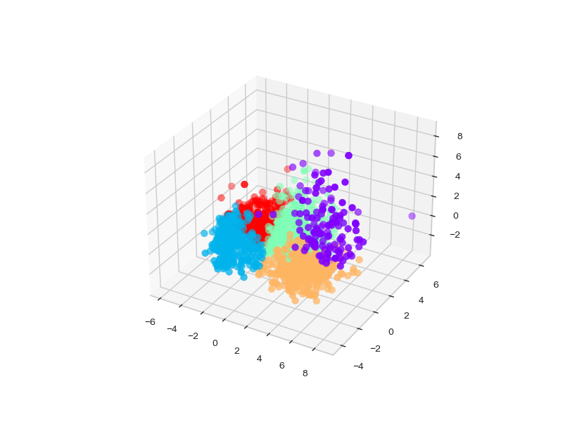
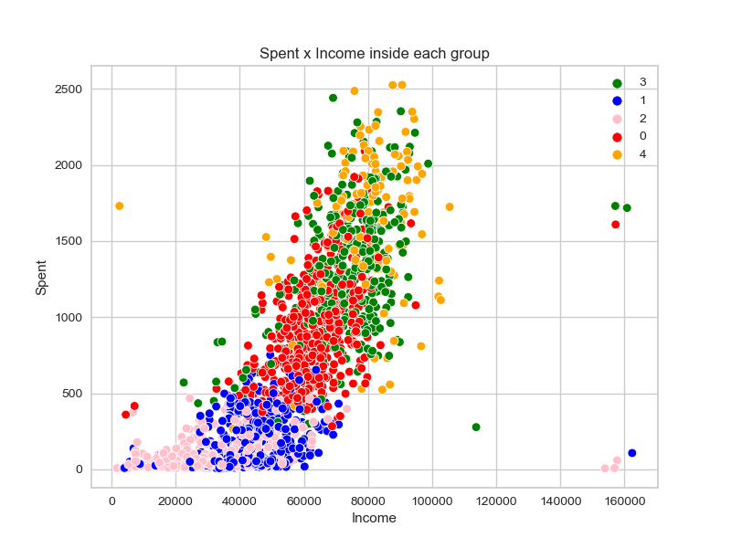

# Customer Segmentation for a Store (with Python)
See the notebook of this project [here](customer_segmentation.ipynb)

## 1. Description

In this project, I performed an unsupervised learning clustering task to segment customers for a store according to their similarities and make recommendations for the business area to offer different promotions to different groups.

I used the machine learning algorithms of **Principal Component Analysis (PCA)** to reduce the dimensionality and **K-Means** for clusterization (segmentation).  By utilizing the Elbow method for the algorithm K-means, I obtained the ideal number of k=5 (five) groups to segmentate.

After segmenting the clients, I did a statistical analysis of the similarities of customers in each group. Finally, I recommend the business some marketing actions specific to each group.

## 2. Tools

The tools used were Python (Pandas, Numpy, Matplotlib, Seaborn, Scikit-Learn), Jupyter Notebook, and Github (version control). We used Statistics for Exploratory Data Analysis (EDA) and Machine Learning algorithms.

## 3. Business problem and project objectives

**Problem statement:**

A retail store has the problem of having few sales, they have already tried to offer 5 promotions but the adherence was weak. Now they want to gain a deeper understanding of their customer characteristics and offer better promotions to have a better performance with the amount of sales.

For this, they want to segment the customers into groups and to strategically utilize this segmentation. This will facilitate the creation of specific promotions adapted to the behaviors of various customer segments. So, the project objectives are:

+ Identify customer groups and create profiles for them;
+ Understand common characteristics of client segments;
+ Make offers based on the features of each customer group;
+ Achieve satisfactory financial results increasing sales.

## 4. Solution

The following pipeline was used for the solution:

1. Introduction and definition of the business problem.
2. Data cleaning.
3. Feature engineering
4. Exploratory data analysis
5. Data Preprocessing
6. Dimensionality reduction.
7. Clustering.
8. Analysis of the clusters
9. Business insights and recomendations to increase sales

## 5. Result

I divided the customers into 5 groups according to their information and purchasing behaviors. These five groups have the following features:

Group 0 (Blue)
+ Customers in this cluster have a relatively low income and low monetary spending.
+ They do not make many purchases.
+ Many have one or more children, and they are not particularly inclined to accept campaigns.

Group 1 (Green)
+ Customers in this cluster have a relatively high income and monetary spending.
+ They prefer web purchases.
+ Some are receptive to campaigns, and many have one child.

Group 2 (Red):
+ This cluster consists of customers with an intermediary income and monetary spending.
+ They prefer both store and web purchases.
+ Most have one or more children, and they are not very likely to accept campaigns.

Group 3 (pink):
+ This cluster includes younger individuals with very low income, low frequency, and low monetary spending.
+ They make relatively small purchases.
+ Most have one child, and they are not receptive to campaigns.

Group 4 (orange): 
+ These customers have a very high average income, moderate frequency and vary high monetary spending.
+ They prefer in-store and catalog purchases and tend to visit the web less frequently.
+ They are open to accepting campaign offers and typically have no children.

## 6. Some visualizations of the solution

A 3D scatterplot of the clustering:

2D scatterplot to illustrate the cluster's separation in different Incomes and monetary Spents:

## 7. Source (dataset link)

The dataset was collected from Kaggle.

Link: https://www.kaggle.com/datasets/imakash3011/customer-personality-analysis

## 8. Contact me

+ Linkedin: https://www.linkedin.com/in/ricardo-bortolotti/

+ Github: https://github.com/ricardo-bortolotti

+ Gmail: ricardo.t.bortolotti@gmail.com
